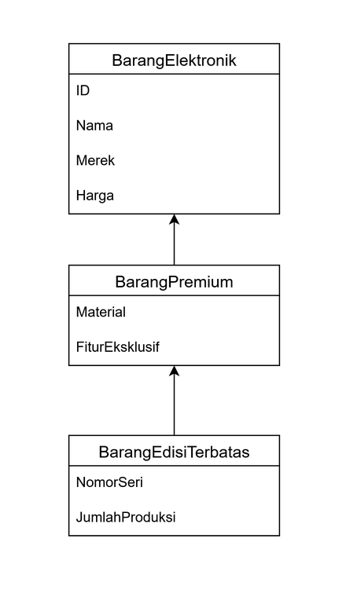
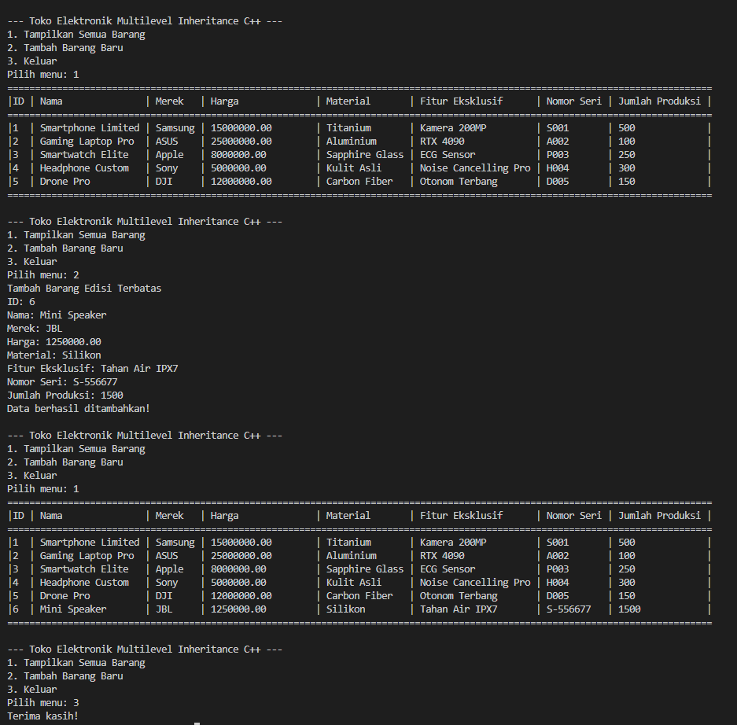
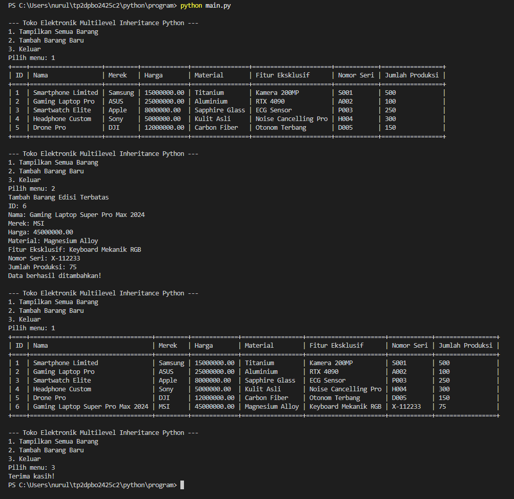
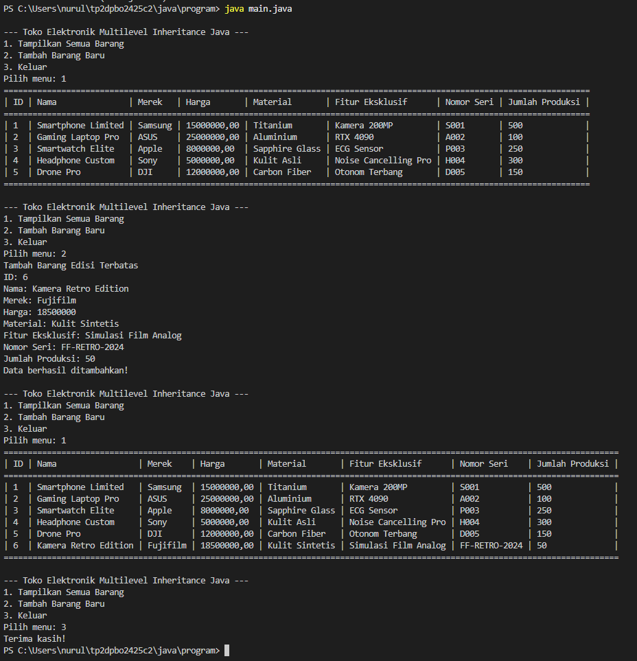

## Janji
_Saya Nurul Atiqah dengan NIM 2406279 mengerjakan soal Tugas Praktikum 1 "OOP dan Enkapsulasi" dalam mata kuliah Desain Pemrograman Berbasis Objek untuk keberkahanNya maka saya tidak melakukan kecurangan seperti yang telah dispesifikasikan. Aamiin._

## Desain dan Struktur Kelas
### Diagram

  

Program ini menggunakan tiga kelas yang saling terhubung melalui multilevel inheritance. Hierarki ini dirancang secara logis untuk merepresentasikan jenis produk yang berbeda di sebuah toko elektronik, dari yang paling umum hingga yang paling spesifik.

#### **BarangElektronik** (Kelas Induk / Level 1)

Ini adalah kelas dasar yang mencakup atribut-atribut umum dari semua produk elektronik.
##### 1. Atribut: 
- id
- nama
- merek
- harga
##### 2. Methods:
- __init__ / constructor: Menginisialisasi objek dengan atribut dasar.
- getter (get_id, get_nama, get_merek, get_harga): Mengembalikan nilai atribut.
- setter (set_nama, set_merek, set_harga): Mengubah nilai atribut.
- display: Menampilkan atribut dasar.

#### **BarangPremium** (Kelas Turunan / Level 2)

Kelas ini mewarisi dari BarangElektronik. Ia menambahkan atribut-atribut yang spesifik untuk produk premium.
##### 1. Atribut: 
- material (material spesial yang menandakan produk premium)
- fiturEksklusif
##### 2. Methods:
- __init__ / constructor: Memanggil constructor dari kelas induk dan menginisialisasi atribut tambahan.
- getter (get_material, get_fitur_eksklusif): Mengembalikan nilai atribut tambahan.
- setter (set_material, set_fitur_eksklusif): Mengubah nilai atribut tambahan.
- display: Menampilkan atribut dari kelas induk dan atribut tambahan.

#### **BarangEdisiTerbatas** (Kelas Turunan Akhir / Level 3)

Kelas ini mewarisi dari BarangPremium. Ini merepresentasikan produk yang sangat langka dan memiliki detail unik.
##### 1. Atribut: 
- nomorSeri
- jumlahProduksi
##### 2. Methods:
- __init__ / constructor: Memanggil constructor dari kelas induk dan menginisialisasi atribut unik.
- getter (get_nomor_seri, get_jumlah_produksi): Mengembalikan nilai atribut unik.
- setter (set_nomor_seri, set_jumlah_produksi): Mengubah nilai atribut unik.
- display: Menampilkan semua atribut dari seluruh hierarki kelas dalam format tabel yang rapi.

## Dokumentasi

### C++
 

---

### Python

---

### Java

---

### PHP

| Tampilkan Data | Tambah Data | Sesudah Tambah Data |
|-------------|----------------|-----------|
|  |  |  |

---
