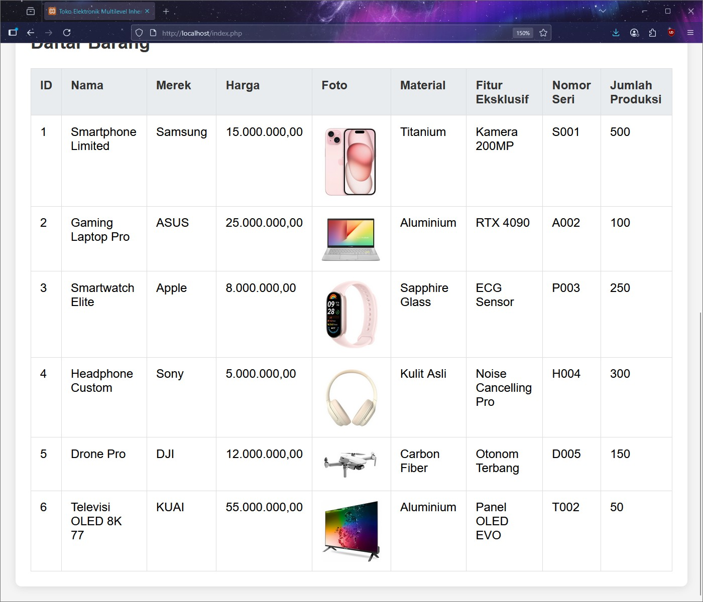

## Janji
_Saya Nurul Atiqah dengan NIM 2406279 mengerjakan soal Tugas Praktikum 2 "Inheritance/Pewarisan" dalam mata kuliah Desain Pemrograman Berbasis Objek untuk keberkahanNya maka saya tidak melakukan kecurangan seperti yang telah dispesifikasikan. Aamiin._

## Desain dan Struktur Kelas
### Diagram

  

Program ini menggunakan tiga kelas yang saling terhubung melalui multilevel inheritance. Hierarki ini dirancang secara logis untuk merepresentasikan jenis produk yang berbeda di sebuah toko elektronik, dari yang paling umum hingga yang paling spesifik.

#### **BarangElektronik** (Kelas Induk / Level 1)

Ini adalah kelas dasar yang mencakup atribut-atribut umum dari semua produk elektronik.
##### 1. Atribut: 
- id
- nama
- merek
- harga
##### 2. Methods:
- __init__ / constructor: Menginisialisasi objek dengan atribut dasar.
- getter (get_id, get_nama, get_merek, get_harga): Mengembalikan nilai atribut.
- setter (set_nama, set_merek, set_harga): Mengubah nilai atribut.
- display: Menampilkan atribut dasar.

#### **BarangPremium** (Kelas Turunan / Level 2)

Kelas ini mewarisi dari BarangElektronik. Ia menambahkan atribut-atribut yang spesifik untuk produk premium.
##### 1. Atribut: 
- material (material spesial yang menandakan produk premium)
- fiturEksklusif
##### 2. Methods:
- __init__ / constructor: Memanggil constructor dari kelas induk dan menginisialisasi atribut tambahan.
- getter (get_material, get_fitur_eksklusif): Mengembalikan nilai atribut tambahan.
- setter (set_material, set_fitur_eksklusif): Mengubah nilai atribut tambahan.
- display: Menampilkan atribut dari kelas induk dan atribut tambahan.

#### **BarangEdisiTerbatas** (Kelas Turunan Akhir / Level 3)

Kelas ini mewarisi dari BarangPremium. Ini merepresentasikan produk yang sangat langka dan memiliki detail unik.
##### 1. Atribut: 
- nomorSeri
- jumlahProduksi
##### 2. Methods:
- __init__ / constructor: Memanggil constructor dari kelas induk dan menginisialisasi atribut unik.
- getter (get_nomor_seri, get_jumlah_produksi): Mengembalikan nilai atribut unik.
- setter (set_nomor_seri, set_jumlah_produksi): Mengubah nilai atribut unik.
- display: Menampilkan semua atribut dari seluruh hierarki kelas dalam format tabel yang rapi.

## Alur Program

Program ini berjalan di antarmuka Command-Line Interface (CLI) untuk C++, Java, dan Python, serta antarmuka web untuk PHP.

### Alur Umum

#### Inisialisasi Awal: 
Program dimulai dengan membuat 5 objek awal dari kelas BarangEdisiTerbatas dan menyimpannya dalam sebuah array/list.

#### Tampilan Menu: 
Pengguna disajikan dengan menu interaktif yang menawarkan beberapa pilihan (misalnya, Tampilkan Data, Tambah Data, Keluar).

#### Aksi Pengguna:

- Tampilkan Data: Program mengiterasi melalui array/list dan memanggil metode display untuk setiap objek. Metode display menggunakan getter untuk mengambil nilai atribut dan mencetaknya dalam format tabel dinamis.

- Tambah Data: Pengguna diminta untuk memasukkan data baru. Sebuah objek BarangEdisiTerbatas baru dibuat, dan setter digunakan untuk mengisi atribut-atributnya dengan data dari input pengguna. Objek ini kemudian ditambahkan ke dalam array/list.

- Keluar: Program mengakhiri eksekusi.

### Implementasi Khusus

Tabel Dinamis: Lebar setiap kolom pada tabel (display) akan secara otomatis menyesuaikan dengan panjang string terpanjang dalam data. Ini dilakukan dengan menghitung lebar maksimum setiap kolom sebelum mencetak tabel.

#### C++ & Java: 
Program menggunakan vector/ArrayList untuk menyimpan objek. Polimorfisme digunakan untuk menampilkan data dari kelas turunan melalui pointer/referensi ke kelas induk.

#### Python: 
Menggunakan list untuk menyimpan objek. Metode isinstance digunakan untuk mendeteksi tipe objek dan mendapatkan atribut yang spesifik.

#### PHP: 
Menggunakan sesi ($_SESSION) untuk menyimpan data objek di sisi server, memungkinkan data tetap ada meskipun halaman di-refresh. Untuk fitur tambah data, digunakan formulir HTML dengan opsi unggah file, dan file gambar disimpan di direktori uploads/.

## Dokumentasi

### C++
 

---

### Python

---

### Java

---

### PHP

| Tampilkan Data | Tambah Data | Sesudah Tambah Data |
|-------------|----------------|-----------|
|  |  |  |

---
